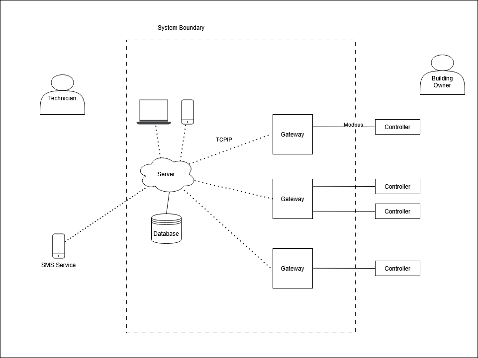
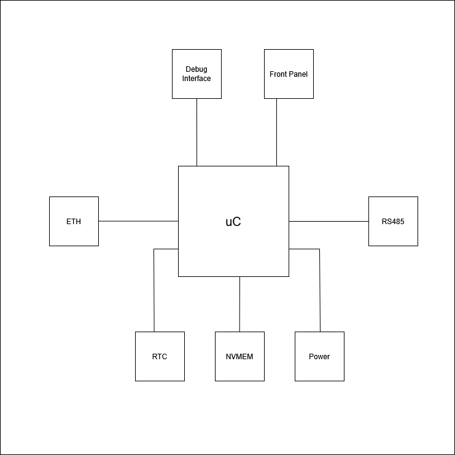
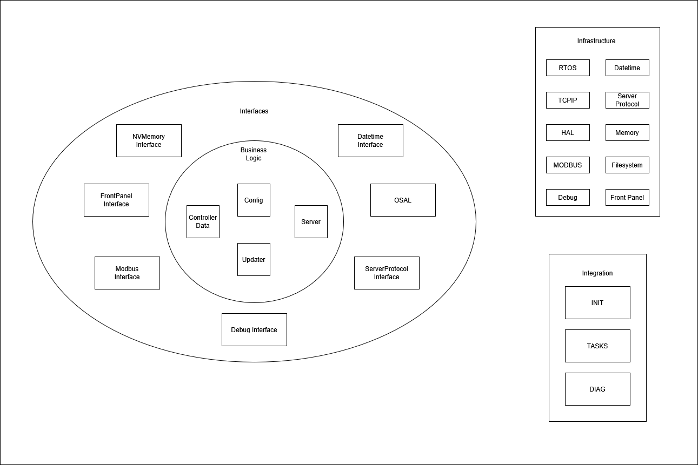

# Architektura systemu

Do opisu architektury systemu użyjemy modelu C4. Poszczególne poziomy modelu mogą później wyewoluować do oddzielnych dokumentów. Projekt architektury powstał na bazie sesji Event Stormingu.

## Kontekst

Na tym poziomie opisujemy otoczenie systemu i interakcje z systemami zewnętrznymi oraz określamy granice naszego systemu.

W otoczeniu naszego systemu zidentyfikowaliśmy następujące elementy:
- Serwer - Element naszego systemu
- Konwerter - Element naszego systemu
- Sterownik budynkowy - System zewnętrzny
- Bramka SMS - System zewnętrzny
- Serwisant - Aktor
- Zarządca budynku - Aktor

Nasz system zawiera jeden centralny **serwer**, który zbiera dane ze wszystkich budynków. Częścią naszego systemu są również **konwertery**. W każdym budynku jest jeden kontroler i do każdego jest podłączony co najmniej jeden sterownik budynkowy.

**Sterownik budynkowy** jest systemem zewnętrznym i nie mamy nad nim kontroli. Musimy być w stanie integrować się z różnymi modelami sterowników od różnych producentów. Aby sterownik współpracował z naszym systemem musi posiadać interfejs Modbus RTU w trybie Slave. Sterowniki budynkowe są konfigurowane niezależnie od naszego systemu i mogą działać bez niego. Aby skonfigurować nasz system do pracy z danym sterownikiem musimy posiadać odpowiednią dokumentację. W szczególności adresy i przeznaczenie poszczególnych rejestrów Modbus.

**Zarządca budynku** to nasz klient, który płaci nam za usługi utrzymania i serwisowania systemu w swoim budynku. Ma możliwość przeglądania danych o swoich budynkach w trybie tylko do odczytu. Każdy obsługiwany przez system budynek może posiadać innego zarządcę.

**Serwisant** to pracownik naszej firmy odpowiadający za konfigurację systemu oraz wykonujący prace serwisowe na obiektach. Ma dostęp do wszystkich widoków systemu w trybie zapisu i odczytu. Inicjuje wiele procesów w systemie i jest odpowiedzialny za ręczne wykonywanie zadań, których nie da się zautomatyzować np. za wprowadzenie konfiguracji z różnych sterowników budynkowych. Być może w przyszłości ta rola zostanie podzielona na kilka ról.

**Braka SMS** to zewnętrzny system służący do wysyłania powiadomień do Serwisantów.

## Elementy systemu

Na tym poziomie opisujemy poszczególne elementy systemu. W systemie embedded mogą to być niezależne urządzenia, płytki PCB itp.

### Serwer

Architektura serwera jest poza zakresem tego ćwiczenia. Skupiamy się na samej części embedded.

### Konwerter

Konwerter zawiera następujące elementy sprzętowe:

Mikrokontroler - Na nim działa główna aplikacja konwertera
RS485 - Interfejs szeregowy do komunikacji Modbus ze sterownikami budynkowymi half duplex, jeden do wielu
ETH - Interfejs Ethernet do komunikacji z Serwerem
RTC - Zegar czasu rzeczywistego do obsługi timestampów
NVMEM - Pamięć nieulotna do zapisu konfiguracji
Power - Blok zasilania 12V z szyny DIN
Front Panel - Diody statusowe montowane na obudowie
Debug Interface - konsola debugowa, test piny i inne elementy ułatwiające debug

Dobór konkretnych elementów oraz schematy elektryczne i PCB w szczegółowym projekcie HW.

### Aplikacja Konwertera

Aplikacja Konwertera została zaprojektowana za pomocą architektury heksagonalnej. Dzięki temu logika bizensowa jest oddzielona od infrastruktury za pomocą interfejsów. Możemy dzięki temu uniezależnić się od platformy sprzętowej i frameworków. Zastosowanie innego RTOSa czy biblioteki Modbus wymaga jedynie dopasowania ich do interfejsów.

Schemat architektury pokazuje główne komponenty, ale nie wchodzi w szczegóły. Komponenty mogą jeszcze zostać rozbite na mniejsze elementy podczas szczegółowego projektowania poszczególnych modułów. Tak samo zaznaczone interfejsy mogą tak naprawdę oznaczać wiele interfejsów w kodzie aplikacji.

**Logika biznesowa**

**Controller Data** - Moduł zarządzający danymi konwertera. Umożliwia inicjalizację danych wartościami z zapisanej konfiguracji, aktualizacje wartości z poszczególnych rejestrów Modbus, odczyt aktualnych wartości.

**Config** - Moduł zarządzający konfiguracją. Umożliwia odczyt aktualnej konfiguracji z pamięci nieulotnej oraz zapis nowej konfiguracji do pamięci.

**Updater** - Moduł odpowiadający za komunikację ze sterownikiem budynkowym. Cyklicznie odpytuje podłączone sterowniki o aktualne dane oraz realizuje żądania nadpisania wartości Modbus na sterowniku.

**Server** - Moduł odpowiadający za komunikację z serwerem. Przygotowuje odczytane ze sterownika dane do wysłania na serwer, przetwarza żądania nadpisania wartości Modbus na sterowniku, update konfiguracji i zapytanie o dane urządzenia.

**Interfejsy**

**OSAL** - Abstrakcja Systemu operacyjnego
**ModbusInterface** - Interfejs biblioteki Modbus
**NVMemoryInterface** - Interfejs pamięci nieulotnej
**DatetimeInterface** - Interfejs czasu i daty
**ServerCommunicationInterface** - Interfejs komunikacji z centralnym serwerem
**FrontPanelInterface** - Interfejs do kontroli front panelu
**DebugInterface** - Interfejs Debugowy

**Infrastruktura**

Tutaj znajdują się implementacje elementów wykorzystywanych przez logikę biznesową określonych przez interfejsy. W praktyce możemy tutaj wyróżnić kilka podgrup:
- **3rd Party** - Zewnętrzne biblioteki i frameworki np. RTOS, stos TCP
- **Devices** - Sterowniki służące do komunikacji ze sprzętem. Tutaj możemy dokonać dalszego podziału na warstwy. **Device** najczęściej będzie się składać z driverów peryferiów grupowanych następnie w moduły realizujące zadaną funkcjonalność sterownika np. warstwy fizycznej Modbus.
- **Middleware** - Dodatkowe moduły stworzone od zera na potrzeby projektu, ale oddzielone od logiki biznesowej za pomocą interfejsów np. protokół komunikacji z serwerem

Każdy z elementów może być bardziej rozbudowany niż logika biznesowa naszej aplikacji i jest niezależnym projektem, który może zostać równie dobrze użyty w innej aplikacji, albo zastąpiony.

**RTOS** - 3rd Party
**TCPIP** - 3rd Party + driver HW
**HAL** - 3rd Party
**Modbus** - 3rd Party + driver HW
**Memory**/**Filesystem** - Prawdopodobnie kombinacja 3rd Party i własnego kodu, albo napisany od zera przez nas. Nie wiemy jeszcze czy system plików będzie potrzebny, czy wystarczy prosty binarny format zapisywanych segmentów. Na pewno ten moduł będzie zawierać również driver HW pamięci nieulotnej.
**Datetime** - 3rdParty/Własny + driver HW
**Debug** - Własny + drivery HW
**Front Panel** - Własny + driver HW
**Server Protocol** - Własny + driver HW

Dlaczego jest interfejs do komunikacji z serwerem, moduł serwer i protokół komunikacyjny?

Na tym etapie jeszcze nie znamy protokołu komunikacji z serwerem. Wiemy tylko, że będzie opierał się na TCPIP i być może na MQTT. Nie znamy też wszystkich zadań realizowanych przez ten protokół, jego formatu binarnego, możliwych komend itp. Jeżeli protokół będzie duży i składający się z wielu warstw - to niezależna biblioteka, która powinna być odseparowana od logiki biznesowej. Może też się okazać, że będzie to prosty adapter na stos TCPIP albo bibliotekę MQTT.

**Integracja**

To warstwa spinająca infrastrukturę z interfejsami logiki biznesowej. Czasem jest też nazywana warstwą przypadków użycia (use case), czy aplikacyjnych reguł biznesowych. Możemy tutaj wywoływać funkcje bezpośrednio z infrastruktury, interfejsów i logiki biznesowej. Ewentualnie dla logiki biznesowej możemy stworzyć publiczne interfejsy.

**Init** - Inicjalizacja HW, bibliotek i aplikacji. Wstrzyknięcie zależności od implementacji interfejsów do logiki biznesowej.

**Tasks** - Implementacja tasków systemu operacyjnego. Niektóre taski będą częścią implementacji bibliotek i logiki biznesowej, ale tutaj znajdują się pozostałe.

**Diag** - Moduł diagnostyczny monitorujący działanie całego systemu i wykrywający błędy. Możemy tutaj zaimplementować np. watchdoga, wykrywanie przepełnienia stosu, safe state itp.

